# Especificação completa para o Codex — Automação local do PJe-Calc

> **Documento de implementação.** Este arquivo consolida o objetivo, o fluxo observado, a arquitetura, a análise da extensão “Copiar e Colar no PJe-Calc”, os contratos de dados, a máquina de estados, os critérios de validação e o plano de entrega.
>
> **Regra de privacidade:** os arquivos de referência contêm dados reais observados na gravação. Eles não devem ser publicados em repositório público. Nenhum nome, CPF, número de processo ou caminho visto no vídeo deve ser codificado como constante no programa.

---

## 1. Instrução direta ao Codex

Implementar uma aplicação **Windows local**, em **Python**, distribuída como **um EXE**, para automatizar um fluxo específico no PJe-Calc Desktop/Cidadão. Ao iniciar, a aplicação deve pedir somente:

1. o arquivo modelo do PJe-Calc (`.pjc`, ou opcionalmente `.zip` contendo `.pjc`);
2. a planilha Excel com dados brutos (`.xlsx` ou `.xlsm`);
3. a pasta onde os resultados serão salvos.

Depois da validação, o programa deve ler os registros do Excel, controlar o PJe-Calc como um usuário, preencher os dados, regerar as áreas necessárias, inserir os valores do histórico, liquidar e gerar:

- um PDF por pessoa;
- o ZIP oficial exportado pelo PJe-Calc, que deve conter um arquivo `.pjc`;
- logs, evidências de erro e banco de retomada.

A execução é totalmente local. Não usar IA, Gemini, API paga, SaaS ou acesso externo durante o processamento.

---

## 2. Decisão tecnológica: Python EXE, não VBS

É possível criar tanto em Python quanto em VBS, mas a implementação definitiva deve ser em **Python**.

O VBS consegue abrir seletores, enviar teclas e interagir com janelas. Entretanto, para um lote de aproximadamente 2.600 cálculos, ele se torna inadequado para:

- leitura confiável de `.xlsx`/`.xlsm` com normalização de datas, CPF e valores;
- controle do DOM da interface web local do PJe-Calc;
- espera por eventos e mensagens reais;
- validação de PDF e ZIP;
- inspeção do conteúdo `.pjc` dentro do ZIP;
- persistência de estado e retomada;
- capturas de tela e diagnóstico estruturado;
- testes automatizados;
- manutenção após mudanças pequenas na interface.

A aplicação continua sendo um “programinha único”: o usuário executa um `.exe`, sem precisar abrir terminal ou instalar Python. Internamente, o código pode ser modular e ser empacotado com PyInstaller.

### Stack recomendada

| Área | Tecnologia | Motivo |
|---|---|---|
| Linguagem | Python 3.12+ | Ecossistema e manutenção |
| Interface | `tkinter` + `ttk` | Já acompanha Python e reduz dependências |
| Excel | `openpyxl` | Leitura sem abrir/modificar o arquivo original |
| PJe-Calc | Selenium + Firefox | A interface é web local e a extensão existente é Firefox |
| Estado | `sqlite3` | Retomada confiável e sem servidor |
| ZIP/PJC | `zipfile` | Biblioteca padrão |
| PDF | validação de assinatura + tamanho | Evita falso positivo de exportação |
| Fallback Windows | `pywinauto` | Somente para diálogo nativo inevitável |
| Empacotamento | PyInstaller `--onefile` | Entrega como EXE único |

Não usar `pandas` se `openpyxl` for suficiente, para manter o EXE menor. Não usar `PyAutoGUI` como estratégia principal.

---

## 3. Contexto operacional

O trabalho contém um lote de aproximadamente 2.600 cálculos trabalhistas. O ganho pretendido não é acelerar o processamento matemático interno do PJe-Calc, mas retirar do operador as ações repetitivas enquanto o sistema processa cada etapa.

O fluxo manual observado dura aproximadamente três minutos em um exemplo e contém 36 ações registradas. A maior fragilidade do processo manual está em:

- copiar nome e CPF de fontes distintas;
- digitar ou colar data final;
- regerar módulos em sequência;
- posicionar corretamente a primeira célula do histórico;
- manter correspondência entre competência e valor;
- esperar processamentos de duração variável;
- salvar dois arquivos com o nome correto;
- repetir tudo por centenas ou milhares de pessoas.

---

## 4. Fluxo visual observado

### 4.1 Início e importação do modelo

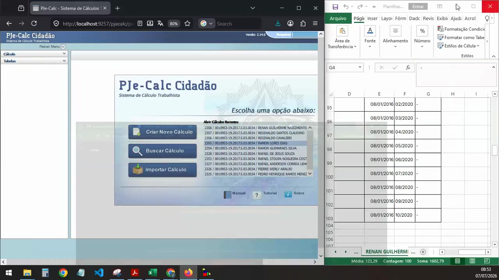

O fluxo começa no PJe-Calc Cidadão, acessível por interface local. O operador escolhe **Importar Cálculo** e seleciona um `modelo.pjc`.

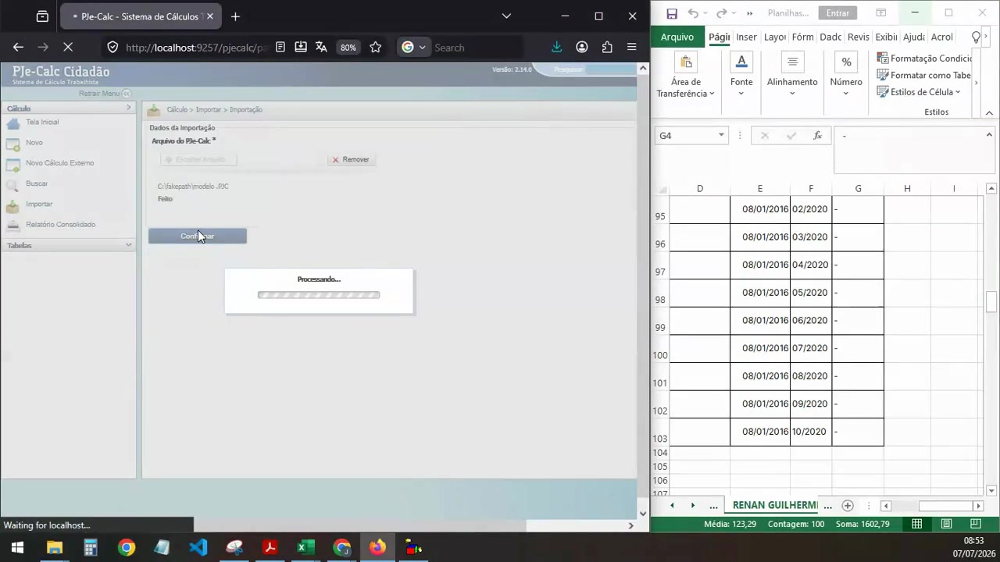

A automação deve evitar o seletor nativo sempre que existir `input[type=file]`: o Selenium pode enviar o caminho diretamente ao elemento, sem clicar por coordenadas.

### 4.2 Nome, CPF e data final

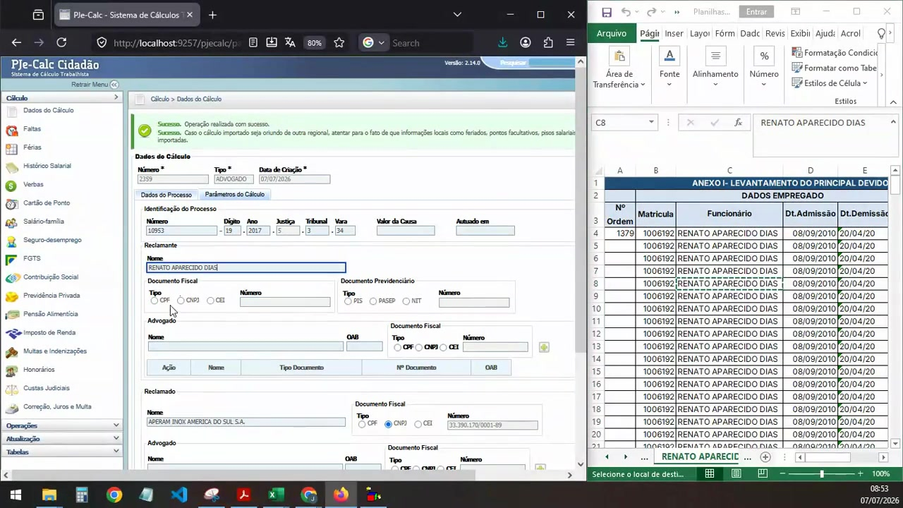

Nome e CPF são transferidos para os campos do reclamante. No vídeo, os dados estavam em abas/posições diferentes. A aplicação deve fazer a associação antes de tocar no PJe-Calc.

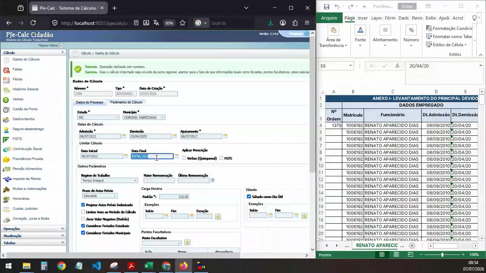

A data de demissão é usada como Data Final quando a regra do registro exigir. O programa precisa ler o valor novamente do DOM após preencher e só então salvar.

### 4.3 Regerações

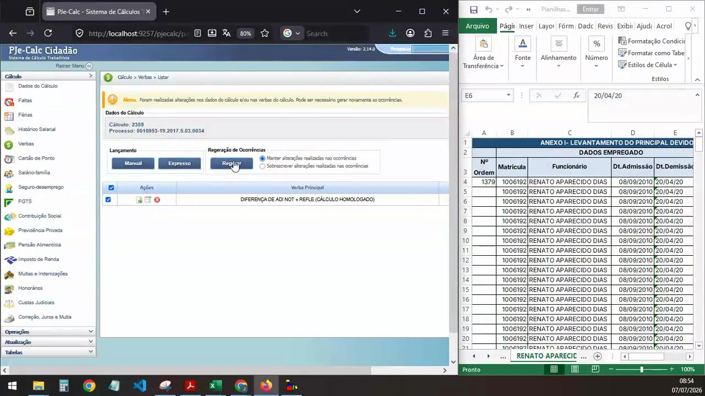

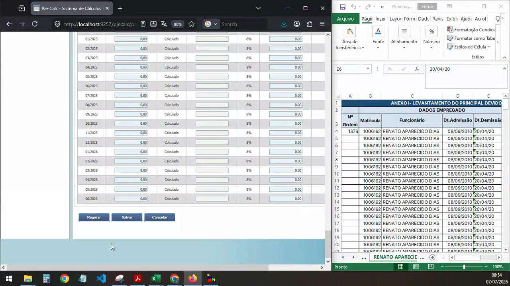

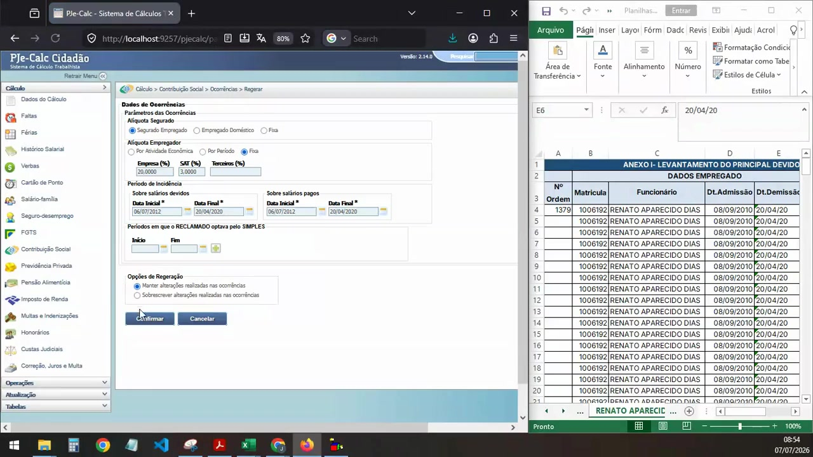

A sequência observada é: Verbas → FGTS → Contribuição Social. Cada etapa deve aguardar a confirmação real de sucesso. Os tempos do vídeo servem apenas para dimensionamento, não como `sleep` fixo.

### 4.4 Histórico salarial e colagem em lote

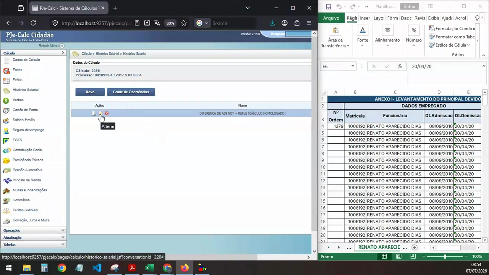

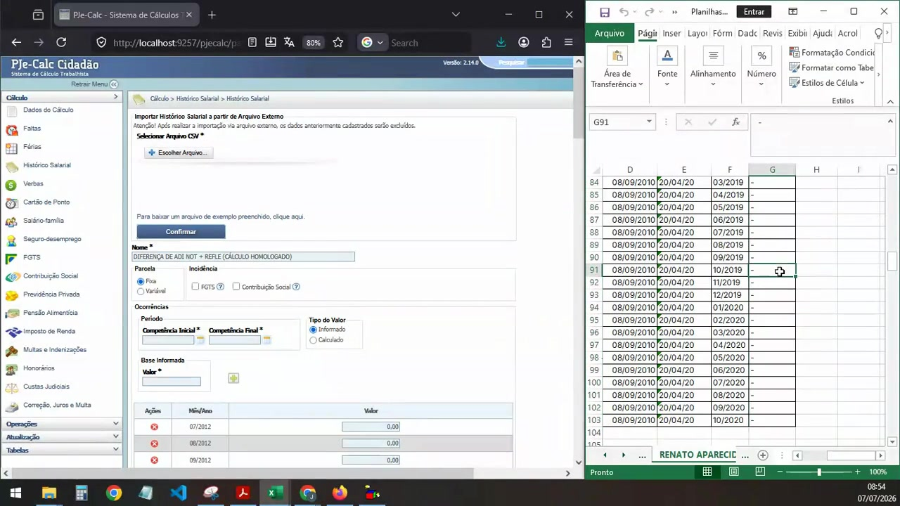

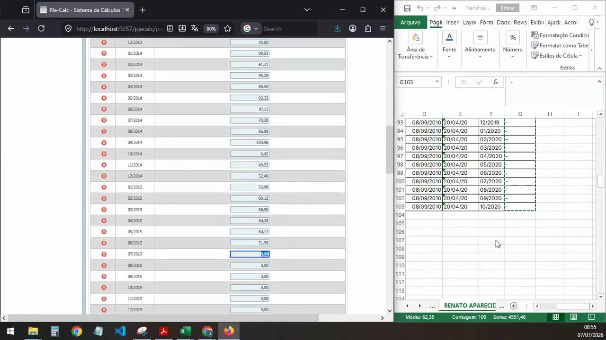

A ferramenta existente comprova que os campos são elementos HTML manipuláveis e que o PJe-Calc reage à alteração do campo ativo e ao evento `ArrowDown`.

### 4.5 Liquidação e exportação

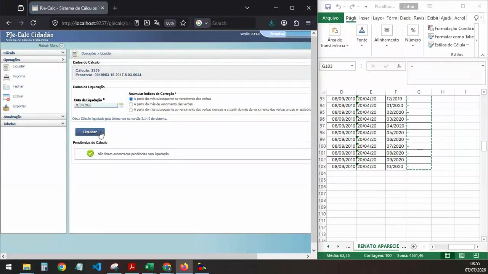

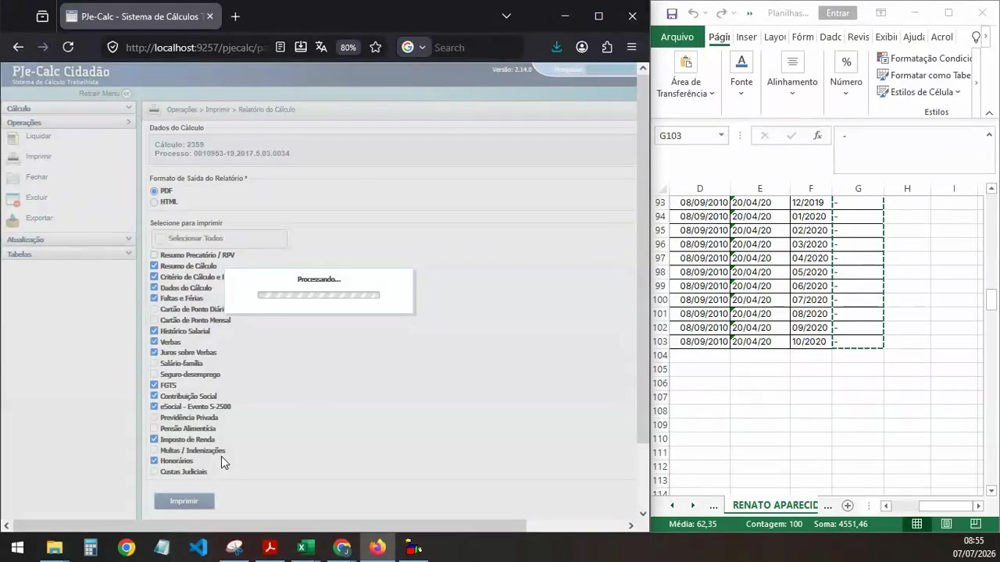

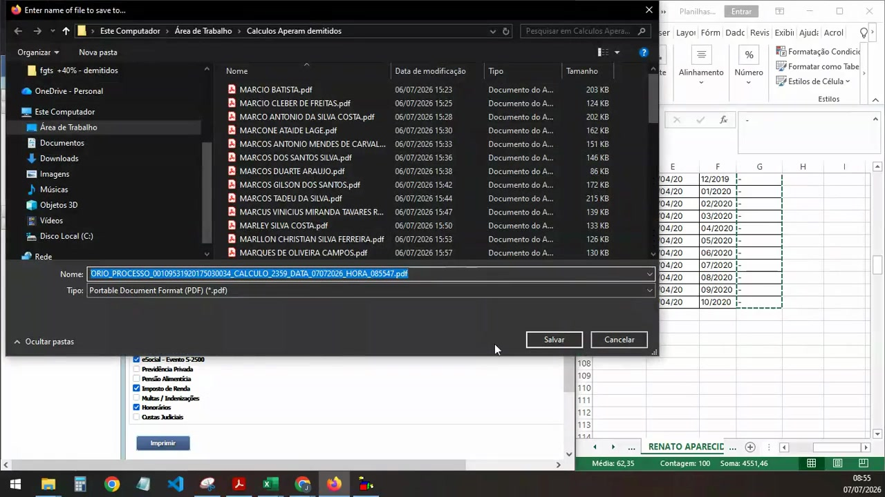

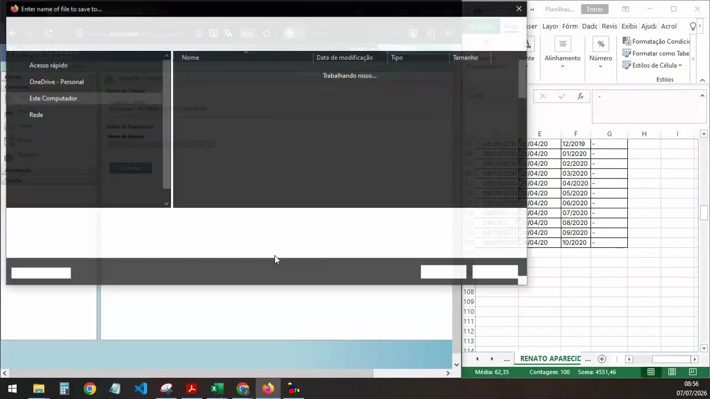

A saída oficial da exportação é um **ZIP**. O ZIP deve conter pelo menos um arquivo `.pjc`. A automação não deve marcar o registro como concluído até validar PDF e ZIP.

---

## 5. Entradas da aplicação

### 5.1 Janela inicial

Criar uma janela simples, sem aparência de SaaS, com os seguintes controles:

- **Modelo do PJe-Calc** — campo somente leitura e botão “Selecionar modelo”;
- **Excel com dados brutos** — campo somente leitura e botão “Selecionar Excel”;
- **Pasta de saída** — campo somente leitura e botão “Selecionar pasta”;
- checkbox **Modo teste: processar somente o primeiro registro**, marcado por padrão na primeira execução;
- checkbox **Retomar execução anterior**, marcado quando houver banco na pasta de saída;
- botão **Validar**;
- botão **Iniciar automação**, desabilitado até a validação;
- área pequena de progresso e status.

Não exibir dezenas de configurações para a usuária. Configurações técnicas ficam em JSON interno ou em uma tela avançada separada.

### 5.2 Modelo

Comportamento obrigatório:

- aceitar `.pjc` diretamente;
- aceitar `.zip` opcionalmente;
- se for ZIP, verificar integridade e localizar `.pjc`;
- se houver zero `.pjc`, bloquear;
- se houver mais de um `.pjc`, pedir escolha ou bloquear com mensagem clara;
- extrair para diretório temporário;
- não alterar o modelo original.

### 5.3 Excel

Comportamento obrigatório:

- abrir com `openpyxl.load_workbook(..., data_only=True, read_only=True)` quando possível;
- não salvar o workbook;
- preservar CPF com zeros à esquerda;
- aceitar datas reais do Excel e strings;
- usar `Decimal` para valores monetários;
- detectar cabeçalhos por texto normalizado, não apenas por letras de coluna;
- gerar uma pré-validação com número de registros válidos, inválidos e ambíguos.

### 5.4 Pasta de saída

Estrutura padrão recomendada:

```text
PASTA_ESCOLHIDA/
├── PDF/
│   └── NOME_SEGURO.pdf
├── PJC/
│   └── NOME_SEGURO.zip
├── logs/
│   ├── execucao.log
│   └── resumo.csv
├── evidencias/
│   └── RECORD_ID/
│       ├── etapa_erro.png
│       └── etapa_erro.html
└── controle/
    └── execucao.sqlite3
```

O nome deve ser sanitizado para Windows. Caracteres `<>:"/\|?*`, controles e pontos/espaços finais precisam ser removidos. Nomes repetidos devem receber um identificador estável, nunca sobrescrever silenciosamente.

---

## 6. Contrato lógico dos dados

O adaptador do Excel deve produzir uma lista independente do layout físico:

```json
{
  "record_id": "0001376",
  "nome": "NOME DO RECLAMANTE",
  "cpf": "00000000000",
  "data_admissao": "08/09/2010",
  "data_demissao": "20/04/2020",
  "processo": "0000000-00.0000.0.00.0000",
  "historicos": [
    {
      "nome": "DIFERENÇA DE ADI NOT + REFLEXO",
      "valores": [
        {"competencia": "07/2012", "valor": "64.12"},
        {"competencia": "08/2012", "valor": "51.90"}
      ]
    }
  ],
  "source": {
    "sheet": "aba de origem",
    "row": 1376
  }
}
```

### 6.1 Pistas observadas no vídeo

- nome na coluna C da aba principal;
- admissão na coluna D;
- demissão na coluna E;
- CPF em aba separada semelhante a `lista_1200_cpf`;
- valores mensais em colunas G/H no exemplo.

Essas posições são apenas pistas do material observado. O código não pode depender delas sem uma configuração ou detecção por cabeçalho.

### 6.2 Regra de associação

Ordem de preferência:

1. matrícula ou identificador único existente em ambas as fontes;
2. CPF normalizado;
3. nome normalizado somente como fallback;
4. se houver mais de um candidato, marcar como ambíguo e não processar automaticamente.

Normalização de nome é para comparação, não para mudar o nome que será gravado:

- remover espaços duplicados;
- `strip`;
- comparação sem diferença de maiúsculas/minúsculas;
- opcionalmente remover acentos somente na chave auxiliar.

### 6.3 Competência e valores

Nunca transformar o histórico apenas em vetor sem chave. Internamente, cada valor deve continuar associado a `MM/AAAA`. Antes da colagem:

- conferir a primeira competência do Excel;
- conferir a primeira competência exibida pelo PJe-Calc;
- conferir quantidade de linhas;
- impedir deslocamento de um mês;
- definir regra explícita para competências faltantes e valores vazios.

---

## 7. Interface técnica do PJe-Calc

O material da extensão e a gravação indicam uma aplicação web local em endereço equivalente a:

```text
http://localhost:9257/pjecalc
```

O PJe-Calc deve estar iniciado e o servidor local acessível. Fluxo de inicialização:

1. tentar uma requisição local à URL base;
2. se responder, abrir Firefox controlado;
3. se não responder e houver caminho configurado para o executável, tentar iniciá-lo;
4. caso contrário, mostrar: “Abra o PJe-Calc e clique em Tentar novamente”;
5. aguardar com timeout total, sem loop infinito.

Não é necessário anexar-se à janela do navegador já aberta. É preferível abrir uma instância controlada apontando para o mesmo servidor local.

### 7.1 Firefox e downloads automáticos

Configurar o perfil para não abrir diálogos de salvar:

```python
preferences = {
    "browser.download.folderList": 2,
    "browser.download.dir": str(download_staging_dir),
    "browser.download.useDownloadDir": True,
    "browser.download.alwaysOpenPanel": False,
    "browser.helperApps.neverAsk.saveToDisk": (
        "application/pdf,application/zip,application/octet-stream,"
        "application/x-zip-compressed"
    ),
    "pdfjs.disabled": True,
}
```

Usar uma pasta temporária de downloads por registro. Depois de validar, mover atomicamente para a pasta final.

### 7.2 Importação sem diálogo nativo

Preferir:

```python
file_input = wait.until(EC.presence_of_element_located((By.CSS_SELECTOR, "input[type='file']")))
file_input.send_keys(str(model_pjc_path.resolve()))
```

Só usar `pywinauto` se o PJe-Calc realmente não expuser input de arquivo utilizável.

### 7.3 Seletores

O PJe-Calc parece usar páginas `.jsf`, portanto IDs podem ser compostos e mudar por prefixo. Estratégias:

- texto visível do menu;
- `label[for]` e campo relacionado;
- CSS com sufixo: `[id$='campoEsperado']`;
- XPath relativo ao rótulo;
- lista de seletores alternativos no arquivo de configuração.

Nunca usar XPath absoluto como `/html/body/div[2]/...`.

Antes de implementar todo o fluxo, criar `tools/dom_probe.py` para salvar:

- URL atual;
- `id`, `name`, `type`, `value` e texto dos inputs/botões/links;
- associação de labels;
- HTML da página;
- screenshot.

O arquivo `spec/selectors.template.json` deve ser completado com dados reais dessa inspeção.

---

## 8. Análise completa da extensão “Copiar e Colar no PJe-Calc”

### 8.1 Natureza do arquivo

O arquivo `copiar_e_colar_no_pje_calc-2.2.3.xpi` não é VBS. É uma extensão para Firefox escrita em JavaScript, Manifest V3.

Metadados principais:

```json
{
  "name": "Copiar e Colar no Pje-Calc 2.0",
  "version": "2.2.3",
  "permissions": ["activeTab", "clipboardRead", "contextMenus", "storage"],
  "shortcuts": {
    "vertical": "Ctrl+Alt+V",
    "horizontal": "Ctrl+Alt+H"
  },
  "firefox_extension_id": "portaldocalculista@gmail.com"
}
```

Arquivos relevantes:

```text
manifest.json
background.js
content.js
options.js
options.html
help.html
icons/
```

O código completo está em `references/extension_src/`.

### 8.2 Páginas-alvo declaradas

A extensão trabalha nas páginas de:

```text
/pjecalc/pages/calculo/historico-salarial.jsf
/pjecalc/pages/calculo/parametrizar-ocorrencia.jsf
/pjecalc/pages/calculo/parametrizar-fgts.jsf
/pjecalc/pages/calculo/inss/parametrizar-inss.jsf
```

Isto é evidência forte de que:

- a interface é DOM manipulável;
- as grades são campos de texto;
- o preenchimento pode ser feito sem reconhecimento de imagem;
- há rotas específicas para Histórico Salarial, Verbas, FGTS e INSS.

### 8.3 Funcionamento observado no código

A colagem vertical:

1. lê texto da área de transferência;
2. separa por linhas;
3. formata cada valor;
4. grava em `document.activeElement.value`;
5. dispara uma tecla `ArrowDown` no campo ativo;
6. espera alguns milissegundos;
7. repete.

Núcleo equivalente:

```javascript
const formattedValue = formatValue(columns[columnIndex]);
document.activeElement.value = formattedValue;
navigateVertically();
setTimeout(() => pasteNextValue(lineIndex + 1, columnIndex), timeout);
```

A colagem horizontal lista todos os `input[type="text"]`, identifica o atual e foca o seguinte.

### 8.4 O que deve ser reaproveitado

Reaproveitar como conhecimento:

- evento `ArrowDown` para mudança vertical;
- ordem de foco para movimento horizontal;
- rotas onde a colagem é válida;
- necessidade de atraso pequeno entre alterações;
- uso do campo que já está ativo como ponto inicial.

### 8.5 O que deve ser corrigido na nova automação

A extensão é útil, mas não é suficiente como motor de lote:

1. **Sinal negativo é removido.** A regex `[^0-9,]` transforma `-15,20` em `15,20`.
2. **Não há callback de conclusão.** Apenas escreve “Colagem concluída!” no console.
3. **Não valida quantidade.** Pode começar na linha errada e deslocar tudo.
4. **Não dispara explicitamente `input` e `change`.** Depende do comportamento da grade.
5. **A navegação horizontal considera todos os inputs de texto da página.** Pode alcançar campos não pertencentes à grade.
6. **O valor padrão de timeout é inconsistente.** Código usa 10 ms, ajuda menciona 50 ms.
7. **Não confere primeiro e último valores.**
8. **A formatação monetária precisa ser baseada em `Decimal`, não `float`.**

### 8.6 Estratégia recomendada no EXE

A aplicação deve incorporar uma versão controlada da lógica, sem depender da área de transferência nem de atalho global. O Python passa uma lista ao JavaScript e recebe um resultado.

Exemplo conceitual:

```javascript
const values = arguments[0];
const startElement = arguments[1];
const delayMs = arguments[2];
const done = arguments[arguments.length - 1];

const sleep = ms => new Promise(resolve => setTimeout(resolve, ms));

(async () => {
  let current = startElement;
  const written = [];

  for (const value of values) {
    current.focus();
    current.value = value;
    current.dispatchEvent(new Event('input', { bubbles: true }));
    current.dispatchEvent(new Event('change', { bubbles: true }));
    current.dispatchEvent(new Event('blur', { bubbles: true }));

    written.push({ id: current.id, value: current.value });

    current.dispatchEvent(new KeyboardEvent('keydown', {
      key: 'ArrowDown', code: 'ArrowDown', keyCode: 40,
      which: 40, bubbles: true
    }));

    await sleep(delayMs);
    current = document.activeElement;
  }

  done({ ok: true, count: written.length, written });
})().catch(error => done({ ok: false, error: String(error) }));
```

O código real deve validar que o foco realmente mudou. Se não mudou, localizar a próxima linha por seletor da grade.

A XPI pode ser empacotada como recurso de diagnóstico ou plano B, mas a execução principal deve usar o JavaScript controlado pelo Selenium.

---

## 9. Máquina de estados e retomada

Cada registro deve ter estado persistido em SQLite:

```text
PENDENTE
VALIDANDO_DADOS
IMPORTANDO_MODELO
PREENCHENDO_IDENTIFICACAO
SALVANDO_PARAMETROS
REGERANDO_VERBAS
REGERANDO_FGTS
REGERANDO_CONTRIBUICAO_SOCIAL
PREENCHENDO_HISTORICO
LIQUIDANDO
GERANDO_PDF
EXPORTANDO_ZIP
VALIDANDO_SAIDAS
CONCLUIDO
ERRO
```

Tabela sugerida:

```sql
CREATE TABLE jobs (
    id INTEGER PRIMARY KEY,
    run_id TEXT NOT NULL,
    record_id TEXT NOT NULL,
    nome TEXT NOT NULL,
    cpf_hash TEXT,
    status TEXT NOT NULL,
    current_step TEXT,
    attempts INTEGER NOT NULL DEFAULT 0,
    pdf_path TEXT,
    zip_path TEXT,
    error_code TEXT,
    error_message TEXT,
    created_at TEXT NOT NULL,
    updated_at TEXT NOT NULL,
    UNIQUE(run_id, record_id)
);
```

Não guardar CPF completo em coluna de log. Se precisar de comparação, usar forma normalizada no objeto em memória e hash/últimos dígitos no banco.

### 9.1 Retomada

Na abertura:

- procurar `controle/execucao.sqlite3`;
- se houver execução incompleta, oferecer retomada;
- registros `CONCLUIDO` com arquivos ainda válidos não são refeitos;
- registros `ERRO` podem ser reprocessados;
- registros em estado intermediário devem reiniciar de um ponto seguro, normalmente importando novamente o modelo para evitar estado parcial do PJe-Calc.

A retomada é por pessoa, não necessariamente pelo último clique exato. O ponto seguro é mais importante do que uma retomada agressiva.

---

## 10. Fluxo automatizado por registro

### Etapa 0 — pré-validação

- validar nome não vazio;
- validar CPF conforme regra configurada;
- validar data final;
- validar histórico e competências;
- construir nome seguro;
- verificar saídas preexistentes;
- registrar job.

### Etapa 1 — importar modelo

- navegar à importação;
- enviar caminho do `.pjc`;
- confirmar;
- aguardar overlay “Processando” desaparecer;
- aguardar mensagem de sucesso;
- conferir que Dados do Cálculo foram carregados.

### Etapa 2 — preencher identificação

- preencher Nome;
- preencher Documento Fiscal/CPF;
- abrir Parâmetros do Cálculo;
- preencher Data Final quando aplicável;
- reler cada campo;
- salvar;
- aguardar mensagem de sucesso.

### Etapa 3 — regerar Verbas

- abrir menu Verbas;
- clicar Regerar;
- aceitar confirmação;
- aguardar sucesso.

### Etapa 4 — regerar FGTS

- abrir FGTS;
- clicar Regerar;
- conferir datas inicial/final;
- confirmar;
- aguardar sucesso.

### Etapa 5 — regerar Contribuição Social

- abrir Contribuição Social;
- clicar Regerar;
- conferir intervalo;
- confirmar;
- aguardar sucesso.

### Etapa 6 — preencher Histórico Salarial

- abrir Histórico Salarial;
- localizar a linha correta pelo nome da verba/histórico, não pela posição “segundo ícone”;
- abrir edição;
- ler competências exibidas;
- alinhar valores por competência;
- localizar o input inicial;
- executar colagem DOM controlada;
- conferir contagem;
- conferir primeiro e último valores;
- opcionalmente amostrar valores intermediários;
- salvar;
- aguardar sucesso.

### Etapa 7 — liquidar

- abrir Liquidar;
- executar liquidação;
- aguardar processamento terminar;
- confirmar mensagem de sucesso.

### Etapa 8 — gerar PDF

- configurar seleção de seções conforme o modelo/fluxo;
- clicar Imprimir;
- monitorar pasta temporária;
- esperar o arquivo deixar de ter extensão temporária e estabilizar tamanho;
- validar assinatura `%PDF-`;
- renomear/mover atomicamente.

### Etapa 9 — exportar ZIP/PJC

- abrir Exportar;
- executar exportação;
- monitorar download;
- validar ZIP com `testzip()`;
- conferir ao menos um nome terminando em `.pjc`;
- mover para pasta final.

### Etapa 10 — concluir

- atualizar SQLite para `CONCLUIDO`;
- registrar duração;
- liberar pasta temporária;
- seguir para próximo registro.

---

## 11. Esperas e confirmações

Não usar somente:

```python
time.sleep(8)
```

Usar condições como:

- presença e visibilidade do elemento;
- botão habilitado;
- overlay de processamento invisível;
- mensagem de sucesso presente;
- URL esperada;
- valor do campo igual ao esperado;
- arquivo criado e tamanho estabilizado.

Criar funções reutilizáveis:

```python
wait_for_success_message(driver, timeout=60)
wait_for_processing_to_finish(driver, timeout=180)
wait_for_field_value(element, expected, timeout=10)
wait_for_download(directory, suffix='.pdf', timeout=180)
wait_for_file_stable(path, stable_seconds=2)
```

Cada ação deve ter timeout. Nenhum loop infinito.

---

## 12. Validação dos arquivos finais

### 12.1 PDF

Validação mínima:

```python
def validate_pdf(path: Path) -> None:
    if not path.exists() or path.stat().st_size < 1024:
        raise OutputValidationError("PDF ausente ou pequeno demais")
    with path.open('rb') as f:
        if f.read(5) != b'%PDF-':
            raise OutputValidationError("Arquivo não possui assinatura PDF")
```

### 12.2 ZIP com PJC

```python
from zipfile import ZipFile, BadZipFile

def validate_pje_zip(path: Path) -> list[str]:
    if not path.exists() or path.stat().st_size == 0:
        raise OutputValidationError("ZIP ausente ou vazio")

    try:
        with ZipFile(path) as zf:
            corrupted = zf.testzip()
            if corrupted:
                raise OutputValidationError(f"Item corrompido: {corrupted}")
            pjc_files = [n for n in zf.namelist() if n.lower().endswith('.pjc')]
            if not pjc_files:
                raise OutputValidationError("ZIP não contém .pjc")
            return pjc_files
    except BadZipFile as exc:
        raise OutputValidationError("Arquivo não é ZIP válido") from exc
```

Somente depois dessas duas validações o job passa para `CONCLUIDO`.

---

## 13. Tratamento de erros

Erros devem possuir código, mensagem amigável e detalhe técnico. Exemplos:

| Código | Situação | Ação |
|---|---|---|
| `PJE_UNAVAILABLE` | localhost não responde | orientar abertura e permitir tentar novamente |
| `MODEL_INVALID` | modelo/ZIP inválido | bloquear antes do lote |
| `EXCEL_MAPPING_ERROR` | cabeçalhos não identificados | gerar relatório de diagnóstico |
| `AMBIGUOUS_PERSON` | associação nome/CPF ambígua | pular registro |
| `SELECTOR_NOT_FOUND` | interface mudou | screenshot + HTML + parar registro |
| `PROCESS_TIMEOUT` | processamento excedeu limite | repetir etapa uma vez |
| `HISTORY_COUNT_MISMATCH` | quantidade de valores divergente | não salvar histórico |
| `HISTORY_ALIGNMENT_ERROR` | competência inicial divergente | não colar |
| `PDF_INVALID` | PDF não gerado corretamente | tentar geração novamente |
| `ZIP_INVALID` | ZIP inválido ou sem PJC | tentar exportação novamente |
| `OUTPUT_CONFLICT` | arquivo válido já existe | respeitar política de sobrescrita |

Em qualquer erro de interface:

1. salvar screenshot;
2. salvar `driver.page_source`;
3. registrar URL;
4. registrar etapa e seletor tentado;
5. atualizar job para `ERRO`;
6. continuar com próximo registro se configurado.

---

## 14. Segurança e privacidade

- não enviar dados à internet;
- não usar telemetria;
- não registrar CPF completo em logs;
- não incluir o Excel, PDF, PJC ou screenshots de produção no Git;
- criar `.gitignore` para `references/`, `output/`, `*.xlsx`, `*.xlsm`, `*.pjc`, `*.zip`, `*.pdf`, bancos e logs;
- usar diretórios temporários separados por execução;
- apagar temporários ao concluir, mantendo apenas evidências de erro;
- nunca alterar o modelo ou Excel de entrada.

Exemplo de `.gitignore`:

```gitignore
output/
references/
*.xlsx
*.xlsm
*.pjc
*.zip
*.pdf
*.sqlite3
*.log
__pycache__/
.venv/
dist/
build/
```

---

## 15. Estrutura de código desejada

```text
pje_calc_automation/
├── pyproject.toml
├── README.md
├── src/
│   └── pje_automation/
│       ├── __main__.py
│       ├── app.py
│       ├── gui/
│       │   ├── main_window.py
│       │   └── progress_view.py
│       ├── domain/
│       │   ├── models.py
│       │   ├── states.py
│       │   └── errors.py
│       ├── excel/
│       │   ├── reader.py
│       │   ├── mapper.py
│       │   └── normalization.py
│       ├── pje/
│       │   ├── browser.py
│       │   ├── selectors.py
│       │   ├── waits.py
│       │   ├── workflow.py
│       │   ├── history_paste.py
│       │   └── downloads.py
│       ├── persistence/
│       │   ├── database.py
│       │   └── repository.py
│       ├── validation/
│       │   ├── inputs.py
│       │   └── outputs.py
│       ├── diagnostics/
│       │   ├── evidence.py
│       │   └── dom_probe.py
│       └── utils/
│           ├── paths.py
│           ├── names.py
│           └── logging.py
├── resources/
│   ├── selectors.default.json
│   ├── app_config.default.json
│   ├── geckodriver.exe
│   └── copiar_e_colar_no_pje_calc-2.2.3.xpi
└── tests/
    ├── test_normalization.py
    ├── test_excel_mapping.py
    ├── test_output_validation.py
    ├── test_safe_names.py
    └── fixtures/
```

Manter as ações do PJe-Calc separadas da GUI. Não colocar todo o programa em um único `.py` só porque a entrega final é um EXE único.

---

## 16. Empacotamento como EXE único

Requisitos:

- localizar recursos com função compatível com PyInstaller `_MEIPASS`;
- empacotar `geckodriver.exe`, JSONs e opcionalmente XPI;
- verificar se Firefox está instalado;
- mostrar erro claro se não estiver;
- gravar banco/logs apenas na pasta de saída, nunca dentro do diretório temporário do EXE.

Função de recurso:

```python
import sys
from pathlib import Path

def resource_path(relative: str) -> Path:
    base = Path(getattr(sys, '_MEIPASS', Path(__file__).resolve().parent))
    return base / relative
```

Exemplo de build, a ajustar no Windows:

```powershell
pyinstaller --noconfirm --clean --onefile --windowed `
  --name Automacao_PJe_Calc `
  --add-data "resources;resources" `
  src/pje_automation/__main__.py
```

Observação: `--onefile` extrai recursos temporariamente quando executa. Para máxima estabilidade, também gerar uma build `--onedir` de diagnóstico durante o desenvolvimento.

---

## 17. Plano de implementação em fases

### Fase 0 — inspeção

- validar que o PJe-Calc responde em localhost;
- criar `dom_probe`;
- identificar seletores reais;
- confirmar download automático de PDF e ZIP;
- confirmar evento necessário para persistir valor nas grades.

**Saída:** relatório técnico e `selectors.local.json`.

### Fase 1 — esqueleto e entrada

- GUI de três seleções;
- validação do modelo;
- leitura do Excel;
- normalização;
- SQLite;
- logs.

**Saída:** EXE que valida e mostra prévia, sem alterar PJe-Calc.

### Fase 2 — um cálculo sem histórico

- abrir Firefox controlado;
- importar modelo;
- preencher identificação e data;
- salvar;
- regerar módulos.

**Saída:** execução de um registro até antes do histórico.

### Fase 3 — histórico

- alinhar competências;
- reimplementar colagem inspirada na extensão;
- validar campos;
- salvar.

**Saída:** um registro completo até histórico salvo.

### Fase 4 — liquidação e exportação

- liquidar;
- PDF automático;
- ZIP automático;
- validações.

**Saída:** PDF + ZIP/PJC válidos para um registro.

### Fase 5 — lote e retomada

- loop de jobs;
- estado persistente;
- retry;
- continuidade após erro;
- resumo final.

**Saída:** teste de 5 e 50 registros.

### Fase 6 — empacotamento

- build onefile;
- teste em máquina sem Python;
- documentação de uso;
- backup e versão.

---

## 18. Critérios de aceite

A primeira versão é aceita quando:

1. solicita os três caminhos;
2. não modifica o Excel original;
3. valida e normaliza um registro;
4. importa o modelo sem coordenadas fixas;
5. preenche Nome, CPF e Data Final e relê os valores;
6. regera Verbas, FGTS e Contribuição Social;
7. preenche o Histórico e comprova alinhamento;
8. liquida;
9. gera PDF válido;
10. exporta ZIP válido contendo `.pjc`;
11. marca o registro concluído no SQLite;
12. em erro, salva screenshot, HTML e mensagem;
13. pode ser reaberta e retomar sem refazer concluídos;
14. roda como EXE sem depender de IA ou serviço pago.

A versão de lote só deve ser liberada após testes progressivos de 1, 5 e 50 registros.

---

## 19. Fluxo completo observado — 36 ações

| Ordem | Tempo | Módulo/Aba | Ação/Botão | Campo | Origem | Espera observada |
|---:|---|---|---|---|---|---|
| 1 | 00:00 - 00:10 | Gravador de Tela Online (online-video-cutter.com) | Nenhum (Apenas visualização) | Nenhum | N/A | 10 segundos |
| 2 | 00:11 - 00:12 | PJe-Calc Cidadão (Página Inicial) | Importar Cálculo | Nenhum | N/A | Menos de 1 segundo |
| 3 | 00:13 - 00:14 | Geral > Importar > Importação | Escolher Arquivo... | Nenhum | N/A | Menos de 1 segundo |
| 4 | 00:15 - 00:17 | Janela do Sistema Operacional (File Upload) | Arquivo 'modelo.pjc' e depois botão 'Abrir' | Campo 'Nome do arquivo' | Diretório local da máquina | 2 segundos |
| 5 | 00:18 - 00:19 | Geral > Importar > Importação | Confirmar | Nenhum | N/A | 1 segundo |
| 6 | 00:20 - 00:23 | Cálculo > Dados do Cálculo | Nenhum | Todos os campos do cálculo preenchidos automaticamente via importação | Metadados do arquivo 'modelo.pjc' | 3 segundos |
| 7 | 00:24 - 00:29 | Planilha Excel (Janela direita) | Barra de rolagem da planilha | Nenhum | Aba 'ANEXO I- LEVANTAMENTO DO PRINCIPAL DEVIDO' | 5 segundos |
| 8 | 00:30 - 00:31 | Planilha Excel (Janela direita) | Seleção da célula C1376 | Nenhum | Aba 'ANEXO I...', Célula C1376 | Menos de 1 segundo |
| 9 | 00:32 - 00:37 | Cálculo > Dados do Cálculo > Dados do Processo | Campo 'Nome' (abaixo do rótulo Reclamante) | Campo 'Nome' alterado para 'NOME DO RECLAMANTE' | Área de Transferência (Célula C1376 do Excel) | 5 segundos |
| 10 | 00:38 - 00:41 | Planilha Excel (Aba lista_1200_cpf) | Troca de aba no Excel e seleção da célula C277 | Nenhum | Aba 'lista_1200_cpf', Célula C277 | 3 segundos |
| 11 | 00:41 - 00:42 | Cálculo > Dados do Cálculo > Dados do Processo | Campo 'Número' (abaixo de Documento Fiscal) | Campo 'Número' preenchido com 'CPF DO RECLAMANTE' | Área de Transferência (Célula C277 da aba lista_1200_cpf) | 1 segundo |
| 12 | 00:43 - 00:54 | Cálculo > Dados do Cálculo > Parâmetros do Cálculo | Sub-aba 'Parâmetros do Cálculo' | Nenhum | N/A | 11 segundos |
| 13 | 00:55 - 00:57 | Cálculo > Dados do Cálculo > Parâmetros do Cálculo | Campo 'Data Final' (dentro do grupo Limitar Cálculo) | Campo 'Data Final' alterado de '30/06/2026' para '20/04/2020' | Coluna E da Planilha Excel (Data de Demissão) | 2 segundos |
| 14 | 00:58 - 01:00 | Cálculo > Dados do Cálculo > Parâmetros do Cálculo | Botão 'Salvar' (localizado no rodapé inferior esquerdo) | Nenhum | N/A | 2 segundos |
| 15 | 01:01 - 01:04 | Menu Lateral Esquerdo | Opção 'Verbas' | Nenhum | N/A | 3 segundos |
| 16 | 01:04 - 01:06 | Cálculo > Verbas > Listar | Botão 'Regerar' (abaixo do título Regeração de Ocorrências) e confirmação no pop-up ('OK') | Nenhum | N/A | 2 segundos |
| 17 | 01:07 - 01:10 | Menu Lateral Esquerdo | Opção 'FGTS' | Nenhum | N/A | 3 segundos |
| 18 | 01:10 - 01:16 | Cálculo > FGTS | Botão 'Regerar' (cabeçalho da seção Dados de FGTS) | Nenhum | N/A | 6 segundos |
| 19 | 01:17 - 01:20 | Cálculo > FGTS > Ocorrências > Regerar | Botão 'Confirmar' (no canto inferior esquerdo) | Nenhum (Datas inicial e final preenchidas com 08/09/2010 e 20/04/2020) | N/A | 3 segundos |
| 20 | 01:20 - 01:22 | Menu Lateral Esquerdo | Opção 'Contribuição Social' | Nenhum | N/A | 2 segundos |
| 21 | 01:22 - 01:26 | Cálculo > Contribuição Social | Botão 'Regerar' e scroll vertical | Nenhum | N/A | 4 segundos |
| 22 | 01:27 - 01:31 | Cálculo > Contribuição Social > Ocorrências > Regerar | Botão 'Confirmar' | Nenhum | N/A | 4 segundos |
| 23 | 01:31 - 01:33 | Menu Lateral Esquerdo | Opção 'Histórico Salarial' | Nenhum | N/A | 2 segundos |
| 24 | 01:33 - 01:36 | Cálculo > Histórico Salarial | Ícone amarelo de edição/lápis (Segunda opção sob a coluna 'Ações') | Nenhum | N/A | 3 segundos |
| 25 | 01:37 - 01:54 | Planilha Excel (Janela direita) | Seleção multidimensional do intervalo de células na coluna G/H | Nenhum | Coluna contendo as diferenças mensais calculadas (linhas correspondentes) | 17 segundos |
| 26 | 01:55 - 01:59 | Ferramenta/Utilitário Externo de Automação (Copiar e Colar do PJe-CALC) | Primeiro campo de digitação (mês 07/2012) no PJe-Calc e botão 'Sim' no aviso da ferramenta | Nenhum inicialmente | Área de Transferência do Sistema Operacional | 4 segundos |
| 27 | 02:00 - 02:14 | Cálculo > Histórico Salarial > Histórico Salarial > Editar | Nenhum (Automação ativa em lote) | Múltiplos campos da tabela de valores da 'Base Informada' correspondentes aos meses/anos | Vetor de valores copiados da coluna do Excel | 14 segundos |
| 28 | 02:15 - 02:17 | Cálculo > Histórico Salarial > Histórico Salarial > Editar | Botão 'Salvar' (no canto inferior esquerdo) | Nenhum | N/A | 2 segundos |
| 29 | 02:18 - 02:23 | Menu Lateral Esquerdo > Operações | Opção 'Liquidar' (abaixo do agrupador Operações) | Nenhum | N/A | 5 segundos |
| 30 | 02:24 - 02:27 | Operações > Liquidar | Botão 'Liquidar' (com ícone de engrenagem/processamento) | Nenhum | N/A | 3 segundos |
| 31 | 02:28 - 02:30 | Menu Lateral Esquerdo > Operações | Opção 'Imprimir' | Nenhum (Opções de seções marcadas por padrão) | N/A | 2 segundos |
| 32 | 02:31 - 02:39 | Operações > Imprimir > Relatório do Cálculo | Botão 'Imprimir' (na parte inferior central da interface) | Nenhum | N/A | 8 segundos (Processamento longo) |
| 33 | 02:40 - 02:47 | Janela Nativa do Sistema Operacional (Diálogo Salvar Como) | Botão 'Salvar' | Campo 'Nome do arquivo' preenchido com 'NOME DO RECLAMANTE.pdf' | Nome do Reclamante (Variável de controle) | 7 segundos |
| 34 | 02:48 - 02:51 | Menu Lateral Esquerdo > Operações | Opção 'Exportar' | Nenhum | N/A | 3 segundos |
| 35 | 02:52 - 03:05 | Operações > Exportar / Caixa de Diálogo Salvar Como (ZIP) | Botão 'Exportar' na interface central e depois botão 'Salvar' na caixa do Windows | Campo de texto nome do arquivo modificado para 'NOME DO RECLAMANTE.zip' | Nome do Reclamante | 13 segundos |
| 36 | 03:06 - 03:08 | Aba do Gravador de Tela Online (Navegador Chrome) | Botão 'Parar' (no canto inferior direito da ferramenta) | Nenhum | N/A | 2 segundos |

A ação 36 encerra apenas a gravação e não integra o produto. Os tempos são observacionais e não devem virar esperas rígidas.

---

## 20. JSONs fornecidos neste pacote

- `spec/workflow_enriched.json` — contrato de alto nível, estados, entradas e saídas;
- `spec/selectors.template.json` — mapa de seletores a completar após inspeção real;
- `spec/app_config.example.json` — configurações recomendadas;
- `spec/excel_mapping.example.json` — regras de leitura e associação;
- `references/analise_acoes_pje_calc.json` — JSON original da auditoria do vídeo.

Trecho do contrato principal:

```json
[
  {
    "id": "model_file",
    "label": "Modelo do PJe-Calc",
    "required": true,
    "extensions": [
      ".pjc",
      ".zip"
    ],
    "behavior": "Se ZIP, extrair exatamente um .pjc para diretório temporário."
  },
  {
    "id": "excel_file",
    "label": "Planilha com dados brutos",
    "required": true,
    "extensions": [
      ".xlsx",
      ".xlsm"
    ],
    "behavior": "Abrir somente para leitura; nunca alterar o original."
  },
  {
    "id": "output_directory",
    "label": "Pasta de saída",
    "required": true,
    "behavior": "Criar PDF, ZIP/PJC, logs, evidências e banco de retomada."
  }
]
```

---

## 21. Materiais de referência do pacote

```text
references/
├── relatorio_auditoria_pje_calc.pdf
├── analise_acoes_pje_calc.md
├── analise_acoes_pje_calc.json
├── gravacao_fluxo_pje_calc.mp4
├── copiar_e_colar_no_pje_calc-2.2.3.xpi
└── extension_src/
    ├── manifest.json
    ├── background.js
    ├── content.js
    ├── options.js
    ├── options.html
    └── help.html
```

Estes materiais são evidência e contexto. O código deve ser dirigido por contratos e seletores verificados, não por valores pessoais visíveis nas referências.

---

## 22. Ordem exata para o Codex começar

1. Ler este documento.
2. Ler `spec/*.json`.
3. Inspecionar `references/extension_src/manifest.json`, `content.js` e `background.js`.
4. Criar a estrutura modular.
5. Implementar testes de normalização, nomes seguros, ZIP/PJC e PDF.
6. Implementar a GUI e pré-validação.
7. Implementar `dom_probe`.
8. Parar e solicitar os seletores reais obtidos no ambiente, caso não seja possível executar o PJe-Calc na máquina do desenvolvimento.
9. Implementar o fluxo de uma única pessoa.
10. Somente após aprovação, implementar o lote.

**Não começar por um script gigante de cliques. Não usar coordenadas fixas. Não assumir que o tempo do vídeo é constante. Não marcar sucesso antes de validar os arquivos.**
